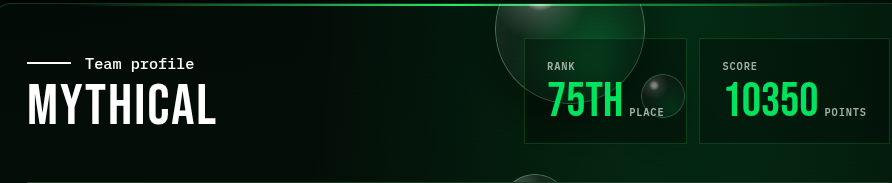
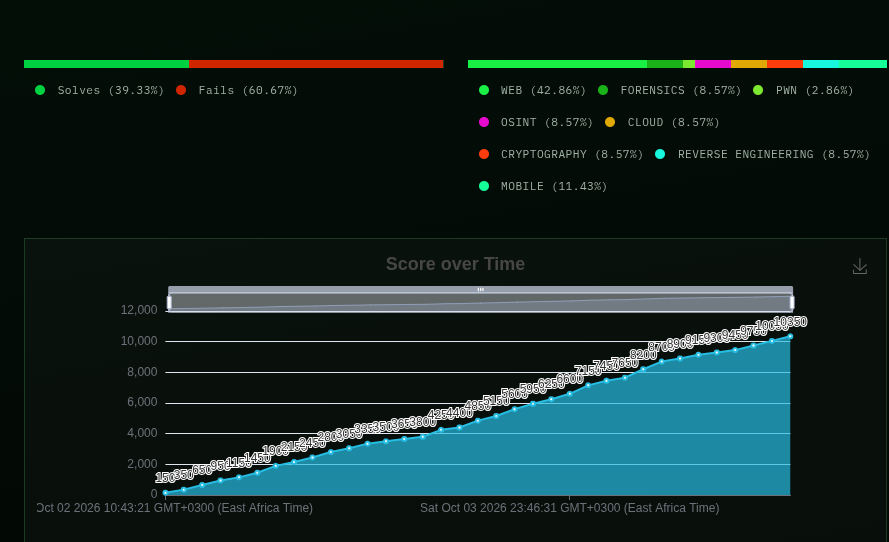

# 🏆 SAF CTF 2026 — Official Writeups & Solutions

<div align="center">



[](safctf.md)
[](safctf.md)
[](safctf.md)
[](safctf.md)
[](safctf.md#master-flag-table)
[](#author--team)

<p align="center">
  <b>Comprehensive writeups, exploit chains, and post-mortem analysis for the SAF CTF 2026 competition.</b><br>
  Authored by <b>pk0n3z</b> — Team <b>MYTHICAL</b>.
</p>

[📖 Read the Full Writeup (safctf.md)](safctf.md) • [🚩 Master Flag Table](safctf.md#master-flag-table) • [🛠 Tools & Techniques](safctf.md#a-tools-reference) • [💡 Key Lessons](safctf.md#c-key-lessons)

</div>

---

## 📊 Performance Overview & Timeline

During the 48-hour Jeopardy-style engagement, Team **MYTHICAL** secured **75th place** out of hundreds of participating teams, scoring **10,350 points** across 22 solved challenges spanning Web, Cloud, Cryptography, Reverse Engineering, Binary Exploitation (PWN), Digital Forensics, and OSINT.

<div align="center">



</div>

### 📈 Solve Distribution & Stats

| Metric | Result | Detail |
|---|---|---|
| **Final Score** | **10,350 Points** | Consistent point progression from 150 to 10,350 |
| **Final Rank** | **75th Place** | Top tier leaderboard standing |
| **Challenges Solved** | **22 Solves** | 39.33% total solve rate across attempted tracks |
| **Primary Domain** | **Web Exploitation (42.86%)** | XXE, SQLi, LDAPi, SSTI, JWT, LFI, SSRF, AI Prompt Injection |
| **Advanced Tracks** | **Cloud, RE, PWN, Crypto, Forensics** | K8s RBAC, AWS ABAC, ret2win, Håstad broadcast, WAL forensic recovery |

---

## 🗂 Repository Structure

```text
SAFCTF/
├── assets/
│   ├── team_profile_banner.png        # Official team ranking & score banner
│   └── score_breakdown_timeline.png   # Solve progression timeline & category chart
├── safctf.md                          # Master writeup (2,000+ lines, deep walkthroughs)
└── README.md                          # Project overview & navigation index
```

---

## 🚩 Master Challenge Index

The full, unabridged writeup with step-by-step payloads, source code diffs, root cause analyses, and remediations is located in [`safctf.md`](safctf.md).

### 🌐 Web Exploitation

| Challenge | Points | Vulnerability / Topic | Key Takeaway | Writeup Link |
|---|---|---|---|:---:|
| **Archived** | 250 | XXE (`file://` & `jar://`) | XML entity expansion exfiltrating server files | [Read](safctf.md#archived) |
| **Pole Position** | — | SQL Injection | Classic auth bypass via `'--` comment truncation | [Read](safctf.md#pole-position) |
| **Between Us** | 450 | UNION-based SQLi | Schema enumeration via `information_schema` | [Read](safctf.md#between-us) |
| **Lightweight Directory** | 150 | LDAP Filter Injection | Closing LDAP filter: `*)(uid=*))(\|` | [Read](safctf.md#lightweight-directory) |
| **Second Look** | 300 | SSTI (Jinja2) | Bypass sandbox filter to execute system commands | [Read](safctf.md#second-look) |
| **Citrus Studio** | — | SSTI Filter Bypass | String concatenation `~` evasion of keyword filters | [Read](safctf.md#citrus-studio) |
| **JWT Forgery** | 150 | Algorithm Confusion | `alg: "none"` signature verification bypass | [Read](safctf.md#jwt-forgery) |
| **Head Office** | 250 | Auth & Header Manipulation | Client header spoofing & privilege escalation | [Read](safctf.md#head-office) |
| **Through the Cracks** | 450 | Local File Inclusion (LFI) | Directory traversal accessing runtime proc environments | [Read](safctf.md#through-the-cracks) |
| **Touchline Dispatch** | 300 | Path Traversal (`pathlib`) | Python `Path / "/abs"` discards base path flaw | [Read](safctf.md#touchline-dispatch) |
| **Harbor Lights** | 300 | IDOR | Direct object reference manipulation in REST API | [Read](safctf.md#harbor-lights) |
| **Blank Space** | 300 | Arbitrary File Upload | MIME-type client spoofing & extension bypass | [Read](safctf.md#blank-space) |
| **Inside Job** | 300 | SSRF & AWS IMDS | IP encoding bypass to reach `169.254.169.254` | [Read](safctf.md#inside-job) |
| **Captain Orders** | 300 | AI / LLM Security | Base64-encoded jailbreak bypassing prompt filters | [Read](safctf.md#captain-orders) |

### 🔐 Cryptography

| Challenge | Points | Scheme / Attack | Key Takeaway | Writeup Link |
|---|---|---|---|:---:|
| **Parallel Lines** | 350 | Stream Cipher Nonce Reuse | Two-time pad XOR attack cancelling out keystream | [Read](safctf.md#parallel-lines) |
| **Three Encores** | 300 | RSA (Low Public Exponent) | Håstad's broadcast attack with CRT & integer $e$-th root | [Read](safctf.md#three-encores) |
| **Midnight Parcel** | 450 | AES-CBC Padding Oracle | Byte-by-byte decryption using padding validity oracle | [Read](safctf.md#midnight-parcel) |
| **Glass Arcade** | — | PBKDF2 + AES-GCM | Decompiling binary routine to extract derivation seeds | [Read](safctf.md#glass-arcade) |

### 🔧 Reverse Engineering & PWN

| Challenge | Points | Architecture / Type | Technique | Writeup Link |
|---|---|---|---|:---:|
| **Comeback Kit** | — | RE / Web Asset Discovery | Timestamp anomaly detection across template files | [Read](safctf.md#comeback-kit) |
| **Clockwork Ballet** | 150 | RE (Tiny Encryption Algorithm) | Identifying TEA magic delta constant `0x61c88647` | [Read](safctf.md#clockwork-ballet) |
| **Pixel Courier** | 150 | Dynamic Binary Analysis | Dynamic GDB inspection over complex permutation loops | [Read](safctf.md#pixel-courier) |
| **Encore** *(Final Boss)* | 500 | 3-Stage PWN / RE Chain | Multi-cipher RE + unbounded `gets()` ret2win stack overflow | [Read](safctf.md#encore) |

### 🔬 Forensics

| Challenge | Points | Artifact / Type | Technique | Writeup Link |
|---|---|---|---|:---:|
| **Android Backup** | — | Android AB Backup Archive | Tar header extraction & app data unpack | [Read](safctf.md#android-backup) |
| **Northern Lights** | — | File Carving & Encrypted Blob | Key derivation from adjacent log artifacts | [Read](safctf.md#northern-lights) |
| **Fancy Details** | 300 | EXIF & Steganography | Extracting nested strings in image metadata | [Read](safctf.md#fancy-details) |
| **Matchday Replay** | 200 | PCAP Protocol Analysis | Custom TCP packet framing reconstruction | [Read](safctf.md#matchday-replay) |
| **Second Pressing** | 250 | SQLite Write-Ahead Log (WAL) | Forensic carving of pre-UPDATE pages from `.db-wal` | [Read](safctf.md#second-pressing) |

### ☁️ Cloud Security

| Challenge | Points | Environment | Technique | Writeup Link |
|---|---|---|---|:---:|
| **Stageworks** | 350 | AWS IAM / ABAC | Session tag manipulation & STS role assumption | [Read](safctf.md#stageworks) |
| **Greenroom Atlas** | 550 | Kubernetes RBAC | Escalating via `patch:rolebindings` to cluster admin | [Read](safctf.md#greenroom-atlas) |

### 🔎 OSINT

| Challenge | Points | Target | Technique | Writeup Link |
|---|---|---|---|:---:|
| **Paper Lanterns** | 200 | Geolocation / Imagery | Landmark triangulation & reverse image intelligence | [Read](safctf.md#paper-lanterns) |
| **Last Tram Home** | 300 | Transit Schedules | Transit route timing correlation & timetable matching | [Read](safctf.md#last-tram-home) |
| **Blue Meridian** | 550 | Maritime / Geolocation | Vessel tracking & geospatial beacon analysis | [Read](safctf.md#blue-meridian) |

---

## 🛠 Weaponry & Tooling Reference

```
┌───────────────────────────────────────────────────────────────────────────┐
│                           OFFENSIVE TOOLKIT                               │
├───────────────────┬───────────────────┬───────────────────┬───────────────┤
│ Web & Network     │ Reverse & Binary  │ Cryptography      │ Forensics     │
├───────────────────┼───────────────────┼───────────────────┼───────────────┤
│ • Burp Suite Pro  │ • Ghidra          │ • CyberChef       │ • Wireshark   │
│ • cURL & HTTPie   │ • GDB (pwndbg)    │ • PyCryptodome    │ • tshark      │
│ • ffuf & gobuster │ • pwntools        │ • gmpy2 / sympy   │ • binwalk     │
│ • jwt_tool        │ • checksec        │ • SageMath        │ • sqlite3/hex │
│ • sqlmap          │ • IDA Free        │ • RsaCtfTool      │ • exiftool    │
└───────────────────┴───────────────────┴───────────────────┴───────────────┘
```

---

## 💡 Core Takeaways & Engineering Lessons

1. **Static Analysis Proposes, Dynamic Analysis Disposes:**
   Theoretical formulas derived from disassemblers frequently disagree with runtime state due to compiler optimizations or calling conventions. Breakpoints in `gdb` provide ground truth.
2. **Path Resolution Precedes Authorization:**
   In modern microservices and web apps, naive sanitization that fails to normalize paths (`pathlib.Path` or `..` normalization) will bypass access controls.
3. **Preserve Digital Evidence Before Inspection:**
   When performing forensic analysis on databases or file systems (e.g., SQLite WAL), never inspect the live database directly without creating a forensic duplicate (`cp`), as engines checkpoint and overwrite deleted data.
4. **Defense in Depth for Modern Cloud:**
   Role policies are meaningless without principle of least privilege: granting `patch:rolebindings` in Kubernetes is functionally identical to granting full namespace-admin privileges.

---

## 👤 Author & Team

- **Author:** **pk0n3z**
- **Role:** Final-year Computer Science Student, *Meru University of Science and Technology (MUST)*
- **Community:** **Android-Community-MUST**
- **CTF Team:** **MYTHICAL**

---

<div align="center">
  <sub>All testing conducted against authorized CTF target infrastructure. Released for educational and research purposes.</sub>
</div>
